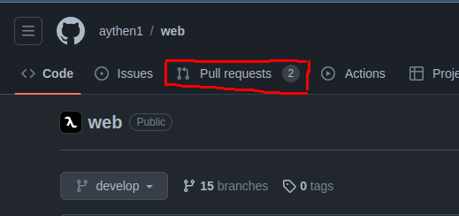
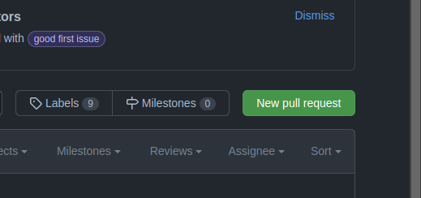
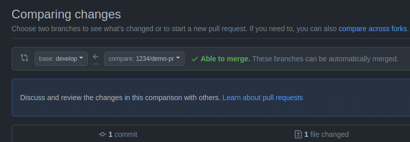
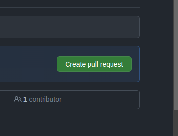
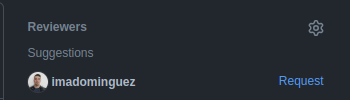
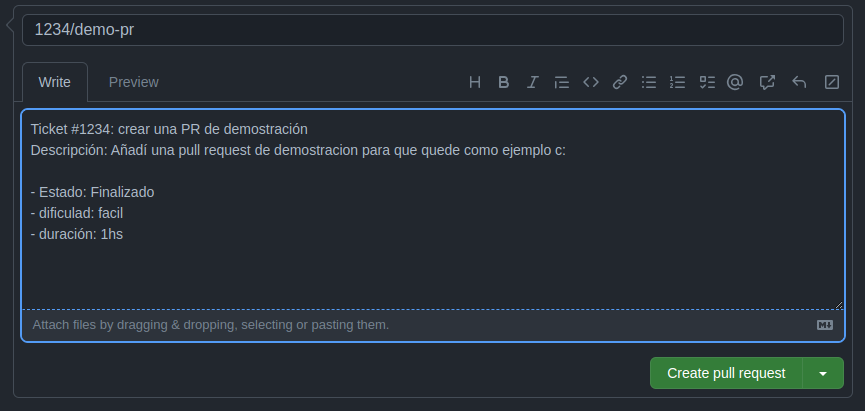

#  GIT FLOW WEB

## RAMAS PRINCIPALES

### MAIN
- Funciones
	- Rama principal del proyecto
	- Contiene el código estable del proyecto
- Restricciones
	- No se debe trabajar directamente sobre esta rama
	- Unicamente se puede fusionar('mergear') con la rama de develop


### DEVELOP

- Funciones
	- Rama de desarrollo
	- Contiene el código en desarrollo del proyecto
- Resitrcciones
	- No se debe trabajar directamente sobre esta rama
	- Unicamente se debe fusionar('mergear') con la rama de feature


# Pasos para trabajar en el proyecto

1. ## Actualizar la rama de DEVELOP
	- Posicionarte en la rama develop
		```
		git checkout develop
		```
	- Actualizar la rama develop
		```
		git pull origin develop
		```

#

2. ## Crear una rama con el ticket de la tarea a realizar
	- Crear una rama con el ticket de la tarea a realizar

		- Desde la consola
			```
			git checkout -b TICKET/ticket-title
			```
			- Ejemplo
				```
				git checkout -b 1234/feature-login
				```
		- Verificar que se creo la rama
			```
			git status
			```
			- Output esperado 
				```
				On branch 1234/feature-login
				nothing to commit, working tree clean
				```
#


3. ## Realizar los cambios en la rama creada

	- ## Nomenclartura de los commits [tipo: descripción]
		- feat: nueva funcionalidad, componente
		- refactor: refactorización del código no de la funcionalidad
		- fix: correcciones en el código
		- style: estilos
		- docs: documentación
	
	- ## Descripcion de cada commit
		- Descripcion brebe de lo que se realizo en el commit
	
	- ## Pasos a seguir
	
		- Añadir los cambios realizados
			- Este comando añade todos los cambios relaizados en la rama
				```
				git add .
				```
		- Realizar el commit
			- Este comando realiza el commit con la descripcion del commit
				```
				git commit -m "tipo: descripción del commit"
				```
			- Ejemplo
				```
				git commit -m "feat: se agrego el componente de login"
				```
#

 4. ## Subir los cambios a la rama creada

	- ### Verificar si no falta ningun cambio por subir
		```
		git status
		```
		- Output esperado
			```
			On branch TICKET/ticket-title
			nothing to commit, working tree clean
			```
		- Ejemplo
			```
			On branch 1234/feature-login
			nothing to commit, working tree clean
			```
			
	- ### Subir los cambios a la rama creada
		- Este comando sube los cambios a la rama creada
			```
			git push origin TICKET/ticket-title
			```
			- Ejemplo
				```
				git push origin 1234/feature-login
				```
#

5. ## Crear una PR(`PULL REQUEST`) en GitHub
	- ### Ir a la pagina de GitHub
	- ### Ir a la pestaña de `Pull requests`
	   

	- ### Crear una nueva PR 
	   
	   - Click en `New pull request`
	- ### Seleccionar la rama de `develop` como base y la rama creada como `compare`
	   
	- ### Crear la PR
	   
	   - Click en `Create pull request`
	- ### Asignar un revisor
	   
		- Click en el engranaje y seleccionar a `franco4457`
	- ### Añadir un titulo y una descripcion
	   
	   - Una vez añadido el titulo y la descripcion, click en `Create pull request`

